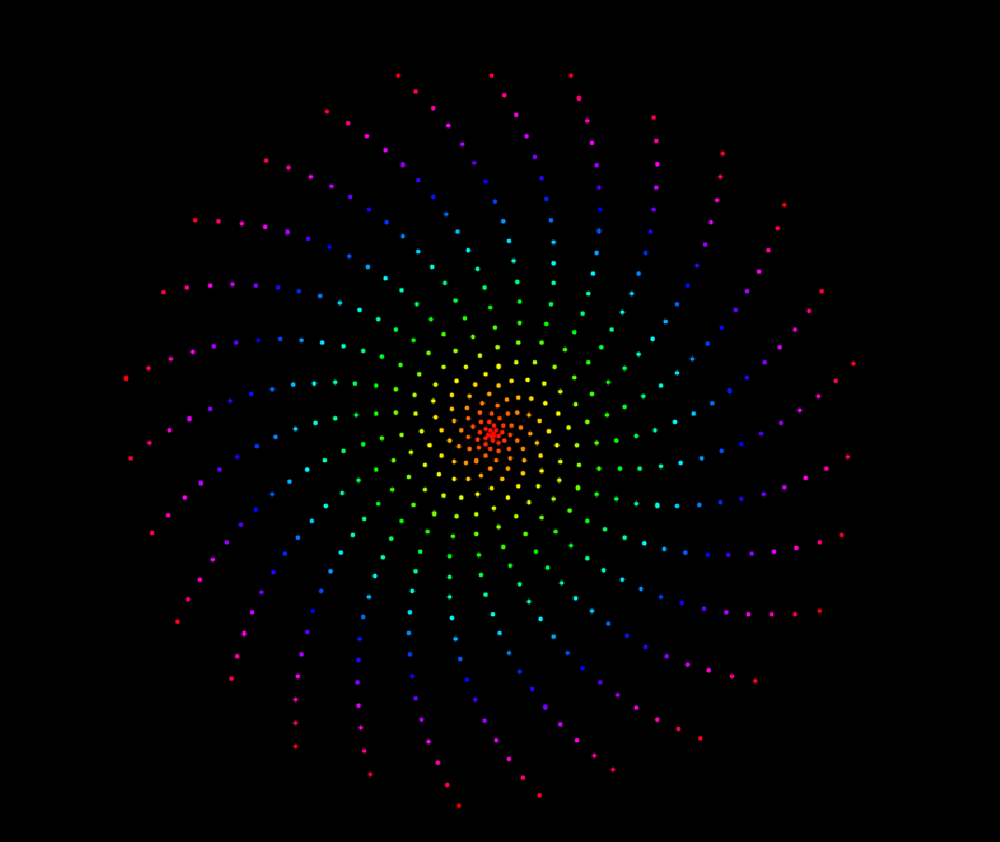
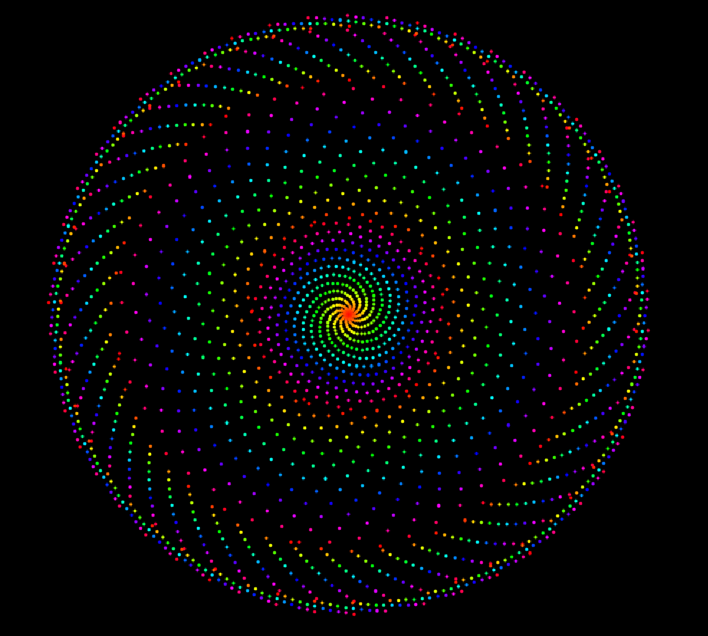
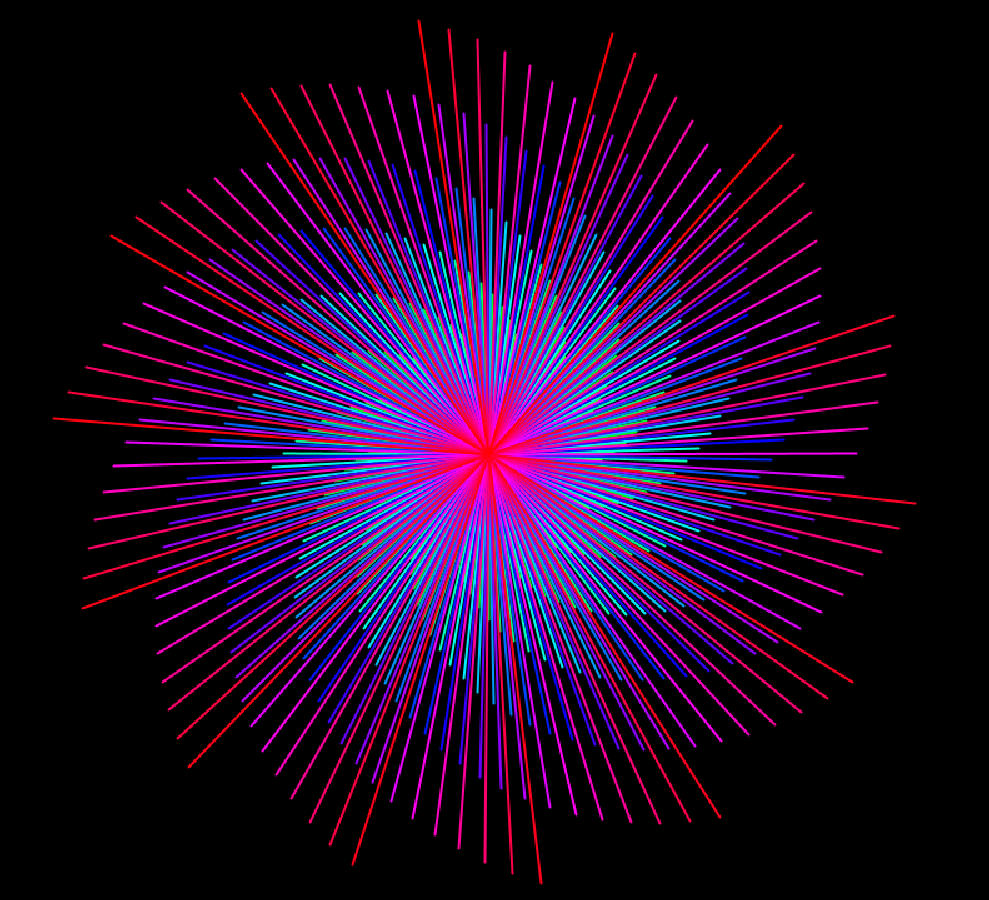
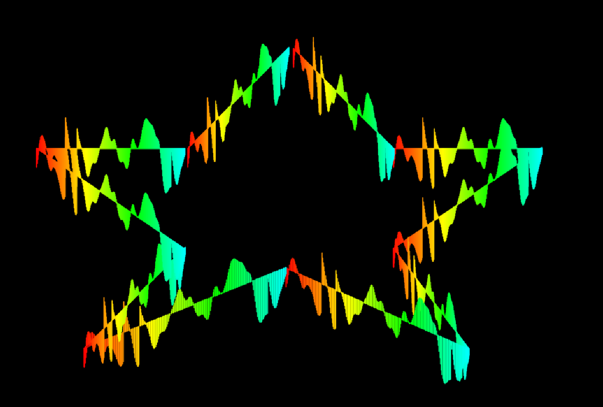
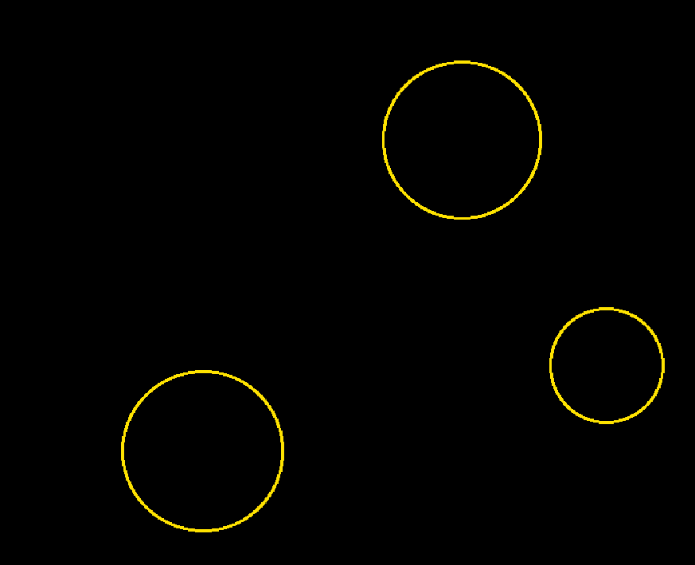
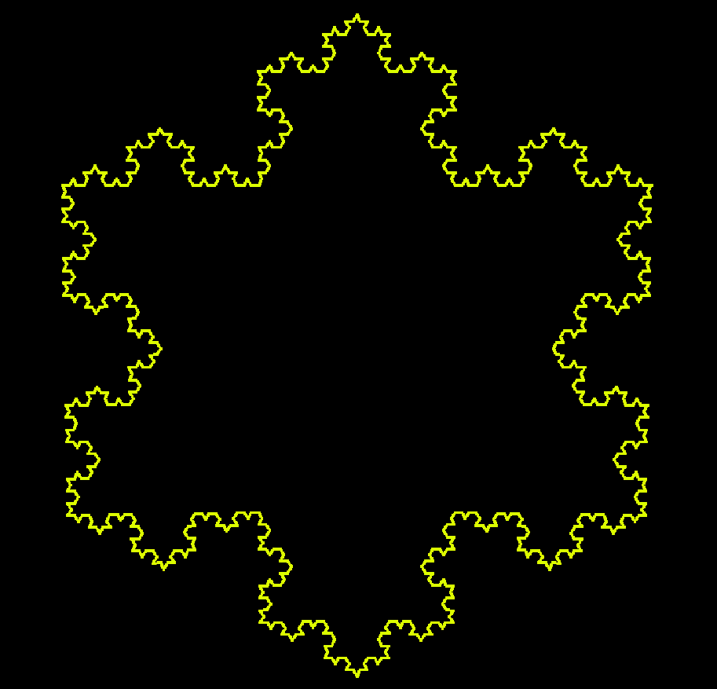

# Music Visualiser Project

Name: Catriona Renaghan

Student Number: C19932586

## Instructions
- Fork this repository and use it a starter project for your assignment
- Create a new package named your student number and put all your code in this package.
- You should start by creating a subclass of ie.tudublin.Visual
- There is an example visualiser called MyVisual in the example package
- Check out the WaveForm and AudioBandsVisual for examples of how to call the Processing functions from other classes that are not subclasses of PApplet

# Description of the assignment
For this assignment, I decided to make visuals that react to music. I designed 6 different visuals.
I call the Processing Functions from other classes, this reduces the length of code in my visual classes. 
Each of the visuals react to the amplitude of the song. 
To draw each of the visuals I used a render() method. 

# Instructions
The program switches between visuals when number keys are pressed. Making it very easy to change visual. 
0. Spiral.java : 		A dotted spiral that spins and enlargens  
1. Spiral2.java :		An enhancement on Spiral.java
2. Spiral3.java :		A spiral that looks like a flower 
3. Sun.java :			A sun with eyes
4. Star.java :			A star that uses waveforms for the edges
5. Circle.java :		Circles of random size that get bigger and smaller to audio
6. Snowflake.java : 	Koch Snowflake Fractal that changes to audio	

# How it works
## CatrionasVisual.java
CatrionasVisual.java is the file that is called from main. This is where I call all the visual classes. 
- I first created objects for each of the visuals. I then created variables needed to display the visuals. 
- Settings() method displays the visuals in fullscreen. 
- setup() method calls startMinim() from Visual.java and calls loadAudio which loads the audio file, I converted Always by Gavin James to an mp3 and inserted it into loadAudio(). Next each of the objects created earlier are assigned their classes with CatrionasVisual being inserted into each of them so methods in CatrionasVisual.java can be retreived and used in each of the classes. For Snowflake.java, three PVectors are created to form points of a triangle, segments are created using the points and are added to snowflakes.
- keyPressed() method starts playing the audio file when the space key is pressed and restarts when pressed. When keys 0 to 6 are pressed, which is assigned the value which is used later to change visuals. 
- draw() method sets the background to be black and the stroke and fill colour to be white. Switch statement calls visuals based on what the variable which stores, the users input. The visuals called for user key input can be seen in instructions. When Circle.java is called it is in a for loop so it occurs twice each time, this allows for more circles to appear on the screen but also slows them down a small bit. When which is 6, translate is used to display the snowflake in the centre of the screen. For each element in the snowflake arraylist it calls the render method in Snowflake.java. It used lerpedAverage to add to the shape. When the variable call is less than lerpedAverage it calls the method repeat() and increases call by 0.25f. The default case is Spiral.java.
- change() method places random values between 0 and the width and height of the screen in x and y variables. This is used in Circle.java to render the circles in random positions. This method is called each time a circle is called.
- repeat() method creates a new ArrayList. For each element in snowflakes arraylist, generate() is called from Snowflake.java and is placed into child. addAll() is then called with child and next. When num = 5, when repeat is called 5 times, num is set back to 0 and the snowflake starts again with three segments, a triangle. This prevents the Snowflake from crashing as more segements are created each time. 
- addAll() method adds elements snowflakes to list and when num = 5 it removes all the elements from snowflakes, allowing it to start over again. 
- checkKey() method checks the key the user enters and changes it to uppercase.
- keyReleased() method changes keys[keycode] to false when the user lets go of the key.


## Spiral.java
- draws a dotted spiral visual.
- render() method sets the colourMode to be HSB, PConstrants prevented any suggestions from appearing. 
- strokeWeight is set to 4, this ensured the dots could be seen in the video. 
- using map allowed the colour of each of the dots change according to the size of the audio buffer. 
- theta multiples i with pie and the smoothedAmplitude so it doesnt jump as much and is smoothand this is multiplied by 5 to give a smaller gap. 
- x is set to be half the width and sin(theta) * r to rotate. 
- y is set to be half the height minus cos(theta) * r. 
- r is increased each time by the amplitude and 0.6f.
- line is drawn using x and y values and amplitude, these are drawn in circles because of the strokeWeight.


## Spiral2.java
- draws a dotted spiral visual that has four levels.
- render() method has four for loops.
- this class is an enhancement of Spiral.java. 
- the difference between each of the for loops is the value thetaInc and getSmoothAmpliude() is multiplied by and the number r is increased by. 
- this makes the dots appear closer or further apart from eachother. 
- since r is a public variable it increases each time and instead of going back to 1f after each for loop it starts from where the last dot was drawn, this creates the visual to appear like it has layers. 


## Spiral3.java
- draws a visual that spins.
- render() is similiar to Spiral1.java.
- thetaInc is divided by the audio buffer size.
- ly contains the audio.
- each of the lines come from the center of the screen and instead of increasing length a line is added to the section, this creates the flower effect when the Amplitude is high.


## Sun.java
- draws a visual that looks like a sun.
- render() uses lerped average to move each of the lines to the music. 
- average is created using by adding the values in Audio buffer and dividing this sum by the size of the Audio buffer.
- this value is then smoothed using lerp().
- the stroke colour is determined this time using getSmoothedAmplitude(), this creates the sun colours. 
- using sin and cos this created the lines growing out of the centre in a circle.
- When I noticed the sunset colours I decided to add a round circle in the middle and added eyes for fun 


## Star.java
- render() draws a star that has a waveform for each of the edges. 
- uses AudioBuffer to draw the wave lines. 


## Circle.java
- render() draws circles of random size using the random function in java.
- these circles then grow to the sound of the music and change colour. 


## Snowflake.java
- this is Koch Fractal Snowflake
- generate() creates new snowflakes for each of the PVectors. 
- each of these new snowflakes are assigned to each child element and child is returned.
- render() changes the colour based on the amplitude and then draws the lines using the PVector a and b x and y values. 


# What I am most proud of in the assignment
I am most proud the Snowflake visual as it uses arraylists and PVectors. Before making the snowflake visual I wasn't very confident using arraylists but now I have more knowledge and understanding on how to use them. I also had to research about PVectors [hyperlink](https://processing.org/tutorials/pvector/). 
When I was getting it to react to music I struggled as I was trying to remove all the elements from the list except the first three. This was not possible so I called setup() then causing problems with the other visuals. This is when I realised assigning the snowflakes object again in repeat() is the best way to do it, as it doesn't effect other code. 
Without using call to limit the amount of times repeat() is called, it jumped to the end snowflake and back again. This call also also allows it to react to music so when lerped average increases slowly, the snowflake changes slowly but when it is being increased quickly it changes quickly.
When repeat() was called more than 5 times the program slowed down and crashed as the lines being drawn were so small and unnoticable, therefore to eliminate this problem I only allowed to call it 5 times before starting over again. 
Facing these problems with the Snowflake visual made completion satisfying which makes it all worth while. I enjoyed the challenge of the assignment and am overall happy with the final outcome.

# Markdown Tutorial

This is *emphasis*

This is a bulleted list

- Item
- Item

This is a numbered list

1. Item
1. Item

This is a [hyperlink](http://bryanduggan.org)

# Headings
## Headings
#### Headings
##### Headings

This is code:

```Java
public void render()
{
	ui.noFill();
	ui.stroke(255);
	ui.rect(x, y, width, height);
	ui.textAlign(PApplet.CENTER, PApplet.CENTER);
	ui.text(text, x + width * 0.5f, y + height * 0.5f);
}
```

So is this without specifying the language:

```
public void render()
{
	ui.noFill();
	ui.stroke(255);
	ui.rect(x, y, width, height);
	ui.textAlign(PApplet.CENTER, PApplet.CENTER);
	ui.text(text, x + width * 0.5f, y + height * 0.5f);
}
```

This is an image using a relative URL:


This is an image using an absolute URL:


This is a youtube video:

[](https://www.youtube.com/watch?v=J2kHSSFA4NU)

This is a table:

| Heading 1 | Heading 2 |
|-----------|-----------|
|Some stuff | Some more stuff in this column |
|Some stuff | Some more stuff in this column |
|Some stuff | Some more stuff in this column |
|Some stuff | Some more stuff in this column |

